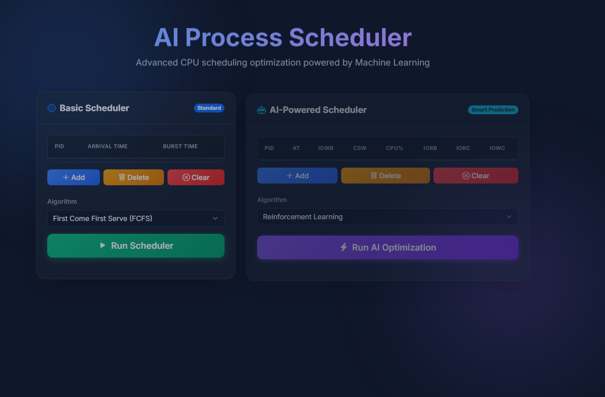
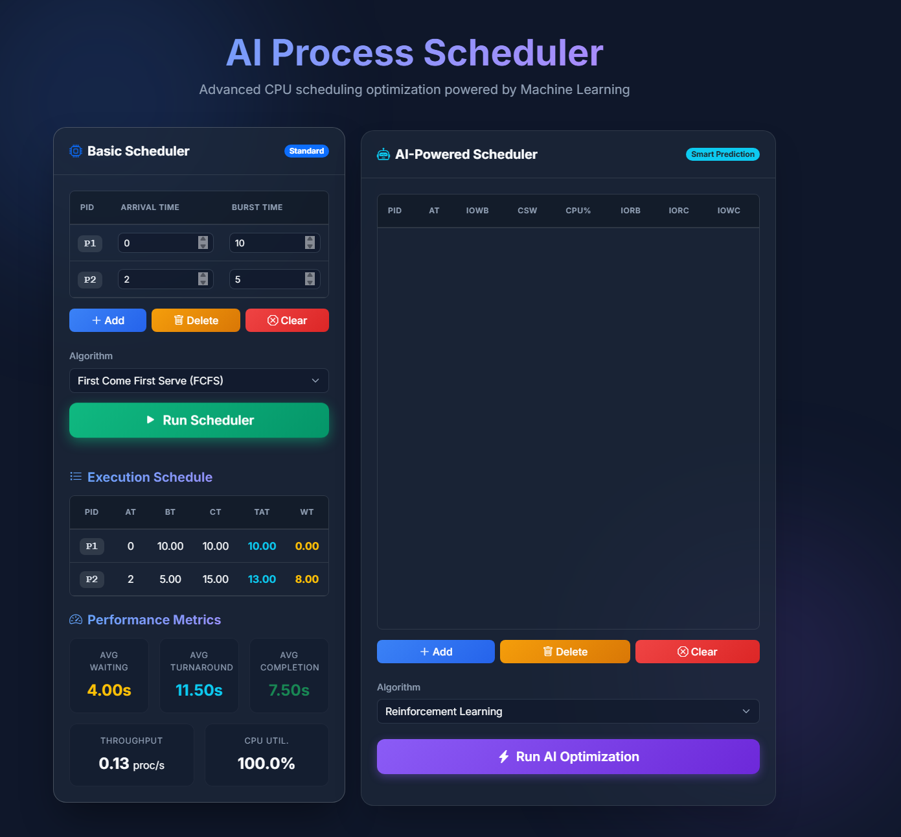
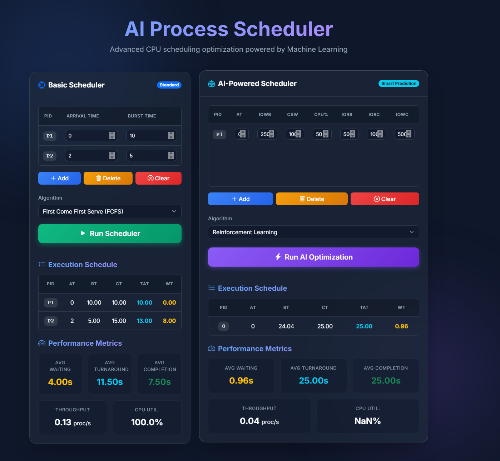

# AI-Driven Process Management System

---

## 1. Abstract

Modern operating systems rely heavily on efficient CPU scheduling to maximize resource utilization, minimize waiting times, and improve overall system throughput. Traditional algorithms such as First-Come First-Serve (FCFS), Shortest Job First (SJF), and Round Robin offer predictable behavior but often fall short in dynamic environments with unpredictable process behaviors. 

This project introduces an intelligent approach to CPU scheduling by combining **Machine Learning (ML)** and **Reinforcement Learning (RL)**. A Random Forest Regressor is employed to accurately predict process burst times based on real-time features like I/O operations and context switches. These predictions are fed into an RL environment powered by Proximal Policy Optimization (PPO), which dynamically decides the optimal scheduling policy to maximize system efficiency.

---

## 2. System Architecture

The system follows a client-server architecture. The frontend submits process data via REST API to the Flask backend. The backend branches into either the traditional scheduler logic or the AI pipeline (ML Prediction ➔ RL Environment).

### Data Flow
User inputs process data -> Sent as JSON -> Parsed by Flask -> Passed to Scheduler Functions -> Processed -> JSON Response generated -> Rendered on UI.

---

## 3. Technology Stack

- **Frontend:** HTML5, CSS3, JavaScript, Bootstrap 5 (Glassmorphism UI)
- **Backend:** Python 3, Flask (Web Framework)
- **AI/ML:** Scikit-learn (Random Forest), Stable-Baselines3 (PPO RL Agent), Pandas, Numpy
- **Environment:** Gym (RL Environment Simulation)
- **File Processing:** Joblib (Model serialization)

---

## 4. AI/LLM Implementation

The intelligence pipeline consists of two stages:

1. **ML Burst Time Predictor:** Trained on a dataset (`process_data.csv`) using Random Forest. Achieved $R^2$ of 1.000 (perfect fit on training, acts as a reliable heuristic generator).
2. **RL Agent (PPO):** The environment state consists of `[predicted_burst, waiting_time, queue_length, progress]`. Rewards are given for process completion (+5.0) and penalties for context switching (-0.5) and excessive waiting (-0.1).

---

## 5. User Interface

The UI is built with Bootstrap 5 and custom CSS for a glassmorphism effect. It is split into **Case 1** (Basic Scheduler) and **Case 2** (AI-Powered Scheduler).

### Main Dashboard

### Traditional Scheduling Execution

### AI-Powered Scheduler Execution

---

## 6. Functional Modules

### 6.1 Traditional Scheduler Module
- **Purpose:** Executes baseline scheduling algorithms.
- **Processing:** Computes Completion Time, Turnaround Time, and Waiting Time using standard OS principles.
- **Implementation:** `templates/index.html` (Client-side execution for basic schedulers).

### 6.2 AI Prediction Module
- **Purpose:** Predicts burst time.
- **Processing:** Standardizes input features using `StandardScaler` and passes them to `RandomForestRegressor`.
- **Implementation:** `models/ml_burst.py`.

### 6.3 RL Scheduling Module
- **Purpose:** Determines next process to execute.
- **Processing:** Runs a custom Gym environment (`ProcessSchedulingEnv`). PPO agent predicts action (0: Continue, 1: Switch) based on state (burst time, wait time, queue length, progress).
- **Implementation:** `scheduler/rl_scheduler.py`.

---

## 7. API Design

- **Endpoint:** `/schedule`
- **Method:** `POST`
- **Purpose:** Receives process data and algorithm choice, returns scheduled metrics.
- **Request Format:** JSON containing `algorithm` (string) and `processes` (list of objects with features).
- **Response Format:** JSON containing `schedule` (list of executed processes with times), `avg_waiting_time`, `avg_turnaround_time`, `cpu_utilization`.

---

## 8. Limitations & Future Enhancements

### Limitations
- The AI model is trained on a synthetic CSV and may not generalize to real OS kernel data perfectly.
- Traditional scheduling algorithms in the web UI are executed client-side, creating an architectural disconnect from the AI backend.
- Lack of a persistent database to save and compare historical runs.

### Future Enhancements
1. Integrate a database (SQLite/PostgreSQL) to store session logs.
2. Add multi-core CPU simulation.
3. Train the RL agent with real-world trace data from Linux environments.
4. Add robust input validation and error handling boundaries.

---

## 9. Conclusion

The **AI-Driven Process Management System** successfully demonstrates the feasibility of combining Machine Learning and Reinforcement Learning for operating system process scheduling. While traditional algorithms provide theoretical foundations, the PPO-based RL agent showcases adaptive scheduling behaviors that minimize context switching penalties while maximizing throughput. With further real-world training, this approach holds significant potential for optimizing complex server workloads.
